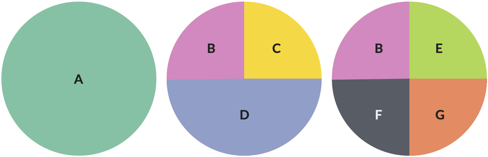
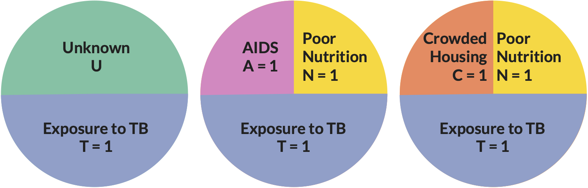

# Causality {#causality}

*Material excerpted and adapted from Lindsay Kobayashi, PhD for EPID601 at the University of Michigan School of Public Health*

Epidemiology is concerned with identifying causes of health outcomes in order to inform effective and equitable interventions to improve them.

What is a cause?

* “An antecedent event, condition or characteristic that was necessary for the occurrence of the disease at the moment it occurred, given that other characteristics are fixed.”

## Three criteria for causation

1. A causal relationship between two variables must have a temporal order, in which the cause must precede the effect in time (i.e., if A is a cause and B is an effect, then A must occur before B).
2. The two variables should be empirically correlated with one another.
3. The observed empirical correlation between two variables cannot be explained away as the result of a third variable that causes both A and B. In other words, the relationship is not spurious and occurs regularly.

## Probabilistic approach
* In epidemiology, the deterministic concept of causation is supplemented or replaced with probabilistic methods so that instead of demonstrating causality in individuals, we make causal inferences about a hypothesized relation between a given exposure and a disease in a particular population.
  * Probabilistic – X leads to a distribution of possible outcomes in a population (or a % probability)
  * Deterministic – X leads to an outcome

## Four causal types
1. Type 1: Doomed
  * Disease occurs with or without exposure 
2. Type 2: Effect causative
  * Disease occurs if and only if person exposed
3. Type 3: Effect preventive
  * Disease occurs if and only if person unexposed 
4. Type 4: Immune
  * Disease does not occur with or without exposure 

Populations consist of individuals of all four causal types

| Causal type | Effect             | Disease outcome if exposed | Disease outcome if unexposed |
| :---------- | :----------------- | :------------------------- | :--------------------------- |
| Type 1      | No effect (doomed) | Case                       | Case              |
| Type 2      | Effect causative   | Case                       | Noncase           |
| Type 3      | Effect preventive  | Noncase                    | Case              |
| Type 4      | No effect (immune) | Noncase                    | Noncase           |

* The exposure has an effect on the disease in Types 2 & 3, but not on Types 1 & 4.
* Cannot observe these types because we cannot observe both exposure states simultaneously in the same individuals, i.e., one exposure condition is counterfactual. 
  * If we observe an exposed person who becomes a case, we cannot determine whether he/she is a Type 1 or 2; If we observe an unexposed person who becomes a case, we cannot whether he/she is a Type 1 or 3.
  * Similarly, if we observe a certain proportion of exposed persons at risk developing a disease in a population, we cannot say how many (if any) were caused by the exposure.

## Four causal inference frameworks

1. Sufficient-Component Cause Model
2. Bradford-Hill’s Viewpoints/Criteria
3. Counterfactual (Potential Outcomes) Framework
4. Directed Acyclic Graphs (DAGs)

We use several models of causation in epidemiology because each model has its own strengths and helps us to examine different epidemiologic concepts 

## 1. Sufficient-component cause model (Rothman's Causal Pie Model)

```{r, out.width='100%', fig.align='center', fig.cap = "Causal pies", echo = FALSE}

```

* Theoretical mechanistic model
  * Each pie represents a sufficient causal mechanism
  * A **sufficient cause** model represents a minimal set of conditions or events that are sufficient for the outcome to occur
  * Acknowledges the multifactorial etiology of health outcomes
  
### Example

```{r, out.width='100%', fig.align='center', fig.cap = "Causal pies example", echo = FALSE}

```

The above figure represents hypothetical sufficient cause models for tuberculosis (TB) infection. U represents unknown causal components. The presence of each causal component implies that their absence (e.g., T=0) would block occurrence of the outcome.

#### Definitions
* **Component cause**: an event or condition that plays a necessary role in the occurrence of some cases of a given disease
* **Necessary cause**: an event or condition that plays a necessary role in the occurrence of all cases of a given disease; must be present for the disease to occur.
* **Causal complement**: the other factors which are necessary and sufficient condition for a factor to produce disease

#### Benefits of sufficient-cause model
Helps us to understand

* Multifactorial nature of disease causation
* That there is often an unknown (U) contribution to disease causation
  * The composition of U may vary between people/populations
* The fraction of a given disease attributable to its component causes often sums to >100%
  * This is due to the multifactorial nature of disease etiology

#### Criticisms of sufficient-cause model
* More useful on a conceptual basis than in application
* Does not depict:
  * Sequential mechanisms (timing of causal components)
  * Direct vs. indirect effects of component causes

## 2. Bradford-Hill's Viewpoints
1. Strength of Association
  * The stronger the association the more likely that the relationship is causal (not representing bias or error)
  * Observation of a weak observation (RR<~2.0) does not negate the possibility of causality
2. Consistency
  * Repeated observation of an association in different populations under different circumstances
  * Consistency of results across epidemiologic studies gets at the heart of inductive reasoning and is used to infer causality in observational studies
  * Should be viewed cautiously, as it may just reflect consistency of confounding or bias across studies
  * Also, may result from publication bias whereby “positive” results are more likely to be published
3. Specificity
  * Cause leads to a single effect, not multiple effects
  * This criteria is INVALID
4. Temporality
  * Exposure must precede the onset of disease
  * Essential for causation
  * Can be difficult to establish temporality
5. Biological gradient (dose-response relationship)
  * Relationship between magnitude (dose) of exposure and risk of outcome is regarded as strong evidence 
6. Plausibility
  * A scientifically plausible mechanism between exposure and outcome is helpful
  * Should be some biological rationale
  * Hill noted that knowledge of the mechanism is limited by the current state of evidence
  * Plausibility can change with time as knowledge grows
7. Coherence
  * Implies a cause-and-effect interpretation for an association does not conflict with what is known of the natural history and biology of disease
8. Experimental evidence
  * Laboratory experiments in animals or humans
  * Often not ethical or possible to randomly assign exposures – we can’t always get experimental data
9. Analogy
  * The effect of similar factors may be considered
  * Not a useful criterion

### 3. Neyman-Rubin Counterfactual Framework
* Also called Rubin Causal Model, Potential Outcomes Model, or simply Counterfactual Framework
* Counterfactual - contrary to the observed fact
* Asks the question, would the outcome have been different if the exposure was not present?

