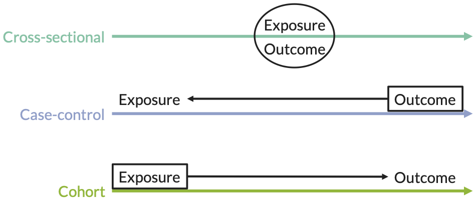
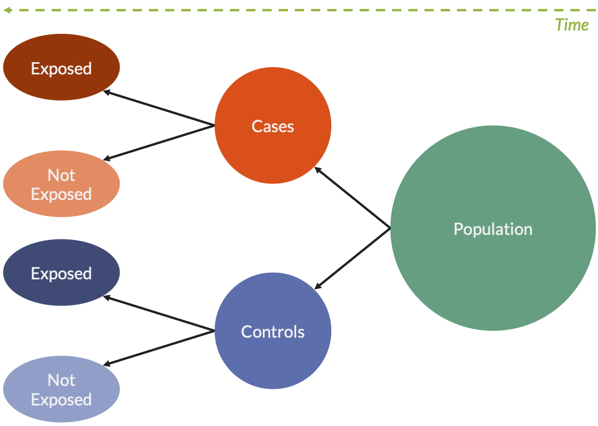
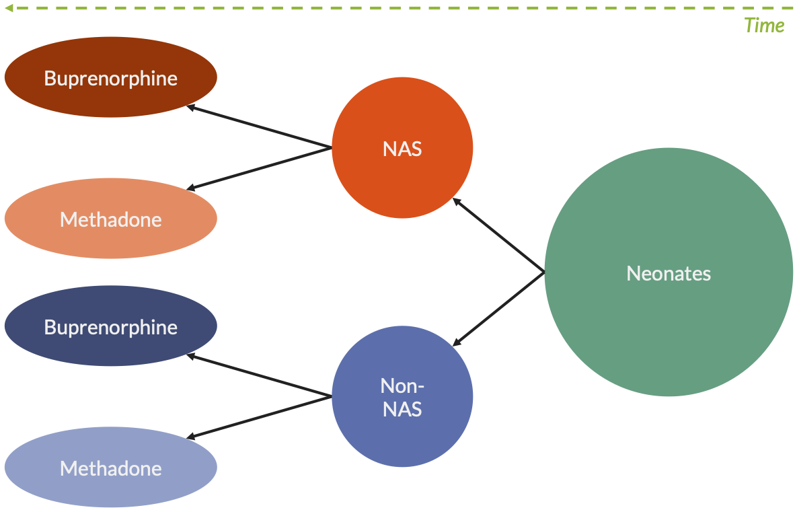
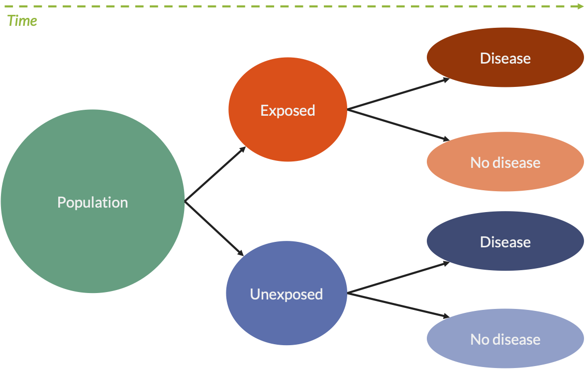
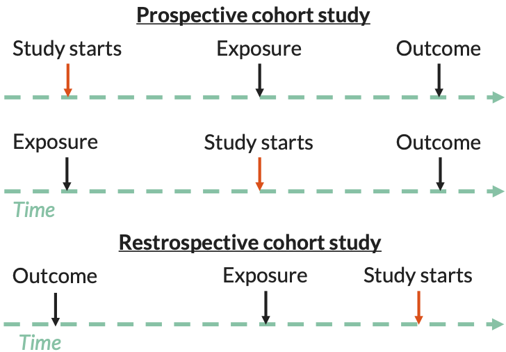
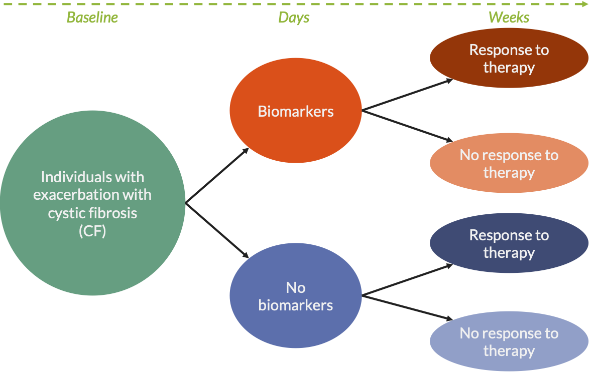
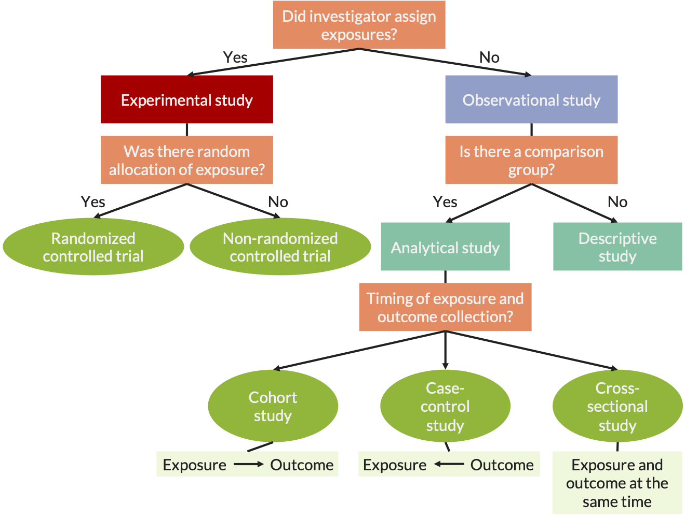

# Study design {#study-design}

*Material adapted from [slides by Jack Jennings, PhD, MPH](https://www.hopkinsmedicine.org/gynecology_obstetrics/pdfs/medstudent/rtc2014/Epi%20Study%20Design%20and%20Exploratory%20Analyses_abb.pdf)*

```{r, out.width='100%', fig.align='center', fig.cap = "Comparison of study designs", echo = FALSE}

```

## Cross-sectional studies
* Measure existing disease and current exposure levels at one point in time
* Sample without knowledge of exposure or disease
* Ex. prevalence studies

### Advantages
* Often early study design in a line of investigation
* Good for hypothesis generation
* Relatively easy, quick and inexpensive ... *depends on question*
* Examin multiple exposures or outcomes
* Estimate prevalence of disease and exposures

### Disadvantages
* Cannot infer causality
* Prevalent vs. incident disease
* May miss latent disease
* May be subject to recall bias

### Example

Research question
 
* Determine whether there are differences in rates of stroke and myocardial infarction by gender and race among patients

Hypothesis

* There will be differences in rates of stroke by gender and race
* There will be differences in rates of myocardial infarction by gender and race

## Case-control studies
* Identify individuals with existing disease/s and *retrospectively* measure exposure

```{r, out.width='100%', fig.align='center', fig.cap = "Case-control schematic", echo = FALSE}

```

### Advantages
* Good design for rare, chronic and long latency diseases
* Relatively inexpensive (population size and time)
* Allows for the examination of multiple exposures
* Estimate odds ratios
* Hospital-based studies and outbreaks

### Disadvtanges
* Multiple outcomes cannot be studies
* Recall bias
* Sampling bias
* Cannot calculate prevalence, incidence, population relative risk or attributable risk
* Beware of reverse causation

### Challenges
* Selection of controls
  * Sample size
  * Matching (group or individual)
* Selection of cases
  * Incident or prevalent cases

### Example

Hypothesis

* Buprenorphine-exposed neonates will exhibit less NAS than methadone-exposed neonates

```{r, out.width='100%', fig.align='center', fig.cap = "Case-control example", echo = FALSE}

```

## Cohort studies
* Identify exposed and unexposed individuals and follow them over time measuring outcomes/s (prospective)

```{r, out.width='100%', fig.align='center', fig.cap = "Cohort study schematic", echo = FALSE}

```

### Prospective vs retrospective cohort studies
* Prospective
  * Study begins before or after exposure but always before collection of the outcome measure
* Retrospective
  * Study begins after collection of the outcome measure

```{r, out.width='100%', fig.align='center', fig.cap = "Prospective vs retrospective cohort study", echo = FALSE}

```  
  
### Advantages
* Measure population-based incidence
* Relative risk and risk ratio estimations
* Rare exposures
* Temporality
* Less likely to be subject to biases (recall and selection as compared to case-control)
* Possible to assess multiple exposures and/or outcomes

### Disadvantages
* Impractical for rare diseases and diseases with a long latency
* Expensive
  * Often large study populations
  * Time of follow-up
* Biases
  * Design: Sampling, ascertainment, and observer
  * Study population: Non-response, migration, and loss-to-follow-up

### Example

Research question

* Determine whether circulating biomarkers (i.e., C-reactive protein; exhaled breath condensate - pH, hydrogen peroxide, 8-isoprostene, nitrie, nitrate levels; sputum - TNF-$\alpha$, IL-6, UK-8, IL-1$\beta$, neutrophil elastase; and fractional exhaled nitric oxide) predict individuals who will benefit from initiation of antibiotic therapy for the treatment of a mild decrease in FEV~1~

Hypothesis

* Biomarkers at the time of presentation with a mild increase in pulmonary symptoms or small decline in FEV~1~ can be used to identify which patients require antobiotics to recover.

```{r, out.width='100%', fig.align='center', fig.cap = "Cohort study example", echo = FALSE}

```  

### Important features
* How much selection bias was present?
  * Were only people at risk of the outcome included?
  * Was the exposure clear, specific, and measurable?
  * Were the exposed and unexposed similar in all important respects except for the exposure?
* Were steps taken to minimize information bias?
  * Was the outcome clear, specific, and measurable?
  * Was the outcome identified in the same way for both groups?
  * Was the determination of the outcome made by an observer blinded to treatment?
* How complete were the follow-up of both groups?
  * What efforts were made to limit loss-to-follow-up?
  * Was loss-to-follow-up similar in both groups?
* Were potential confounding factors sought and controlled for in the study design or analysis?
  * Did the investigators anticipate and gather information on potential confounding factors?
  * What methods were used to assess and control for confounding?
  
## Randomized controlled trials (RCTs)
* Experimental: exposure is assigned
* Randomization assignment
  * Random allocation of exposure or treatment
  * Results (or should result) in two equivalent groups on all measured and unmeasured confounders
  * Gold standard for causal inference

### Advantages
* Least subject to biases of all study designs (**IF** designed and implemented well...!)

### Disadvantages
* Intent-to-treat
* Loss-to-follow-up
* Randomization issues
* Not all exposures can be "treatments," i.e., are assignable
* Some exposures/treatments cannot be ethically randomized

### Example

Research question

* To determine whether resident's attitude and skills in diabetes management and counseling change after a curricular intervention
* To determine whether patient outcomes related to diabetes (e.g., weight, smoking status) change after a curricular intervention among residents

Hypothesis

* Attiudes and skills related to diabetes management and counseling will improve among residents after a curricular intervention
* Fewer patients with diabetes will smoke over time after curricular intervention among residents

### Randomization strategies
* Randomly assigned
* Quasi-randomization
* Block randomization
  * Method of randomization that ensures that at any point in the trial, roughly equal numbers of participants have been allocated to the comparison groups
  
## Study design flowchart

```{r, out.width='100%', fig.align='center', fig.cap = "Study design flowchart", echo = FALSE}

``` 
