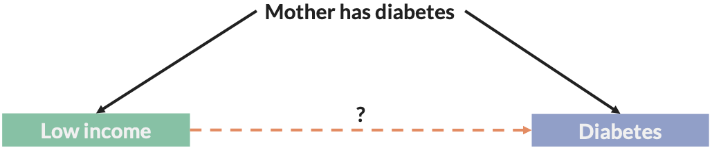
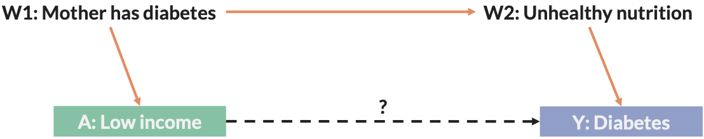
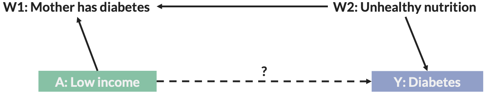
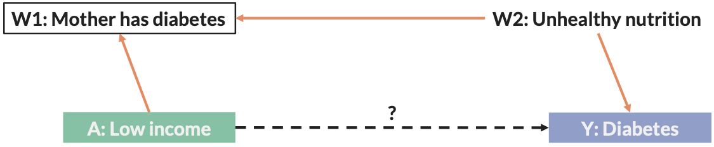
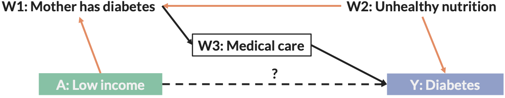

# Confounding bias {#confounding}

## Identifying confounding

### Data-driven approaches
* There are many data-driven approaches that are used to identify confounding that are based on statistical approaches to examine associations in study data
    * Stepwise regression
        * Throw all suspected confounders into a model and remove those not associated with the outcome (e.g., p > 0.05) in a stepwise fashion
    * Change-in-estimate approach (10% rule)
        * Throw all suspected confounders into a model, retain those whose removal changes the exposure -> outcome effect estimate by > 10%

***But*** confounding is about **causal** relationships, thus it is best to identifying confounding by using causal relationships

* The observed data structure and *a prior* theory or knowledge about the suspected data structure are used to identify confounding
* This is better than stepwise regression or the change-in-estimate approach, which use arbitrary rules based on statistical significance

### Structural approach
 
#### Three criteria
A confounding factor must:

1. Be a cause of the outcome under study
2. Be associated with the exposure under study in the source population
3. Must not be caused by the exposure or disease

#### Criteria 1: Confounding factor must cause the outcome (either directly or indirectly)
* A confounding factor must be a cause of the outcome
    * May be an actual cause of the disease
    * May be a surrogate/proxy or indirect cause of the disease
        * Household income as a surrogate for a milieu of social factors correlated with income
        * Education as a proxy for literacy
    * Prior theory or knowledge (not the data itself) is used to determine the relation of the suspected confounding factor to the outcome

#### Criteria 2: Confounding factor must be associated with the exposure in the source population
* We can generally identify this directly from our data, however varies a bit by design
* Cohort Study
    * Cohort is source population. Therefore, this relationship can be determined from the observed study data.
* Case-control Study
    * In a C-C study, the controls are selected from the source population, however, the control group needs to be very large and have no selection bias or measurement error in order to accurately reflect the association in the source population.
    * External information can be used when available, or prior knowledge.

#### Criteria 3: The factor cannot be caused by the exposure or the disease
* A confounding factor must not be affected by the exposure or the disease. 
* Two scenarios can occur here:
    1. The factor that we think is a confounder is actually an intermediate on the causal pathway between exposure and outcome (a **mediator**)
    2. The factor that we think is a confounder is a common outcome of the exposure and outcome of interest (a **collider**)

#### Intermediate on the causal pathway (Mediator)
* Here, low birth weight is on the causal pathway from maternal smoking and perinatal mortality

```{r, out.width='100%', fig.align='center', fig.cap = "Example of mediator", echo = FALSE}
knitr::include_graphics('img/confounding/mediator_example.png')
```

* Low birth weight is a **mediator**. Adjusting for a mediator is referred to as "over-adjustment"

Another example: Fluoridation, Diet sugar, and Tooth decay

```{r, out.width='100%', fig.align='center', fig.cap = "Example of a collider", echo = FALSE}
knitr::include_graphics('img/confounding/overadjusting_example.png')
```

#### Confounding is structural
* Confounding arises because of how, structurally, the variables are related to each other
  * Either how they are naturally related to each other, or, how they are related to each other after an investigator has changed the relationships by adjustmnet, matching, conditioning, etc.
  
How do we know what the proper structural relationships are?

* Directed Acyclic Graphs (DAGs)
  * NOT a method of data analysis
  * They are used to IDENTIFY confounders based on the assumptions we are willing to make
* DAGs help us to depict the assumed temporal structure of the relationships between our factors
  * Both in the state of nature
  * And after investigators have intervened on the natural structure by conditioning on a set of factors

So

```{r, out.width='100%', fig.align='center', fig.cap = "Example of confounding",echo = FALSE}

```

* We want exchangeability of those with low vs. non-low income, condition on having a mother with diabetes (conditional exchangeability)
* The goal is to block all backdoor paths from the exposure to the outcome on the DAG

#### DAG rules for identifying confounding
1. To get from A to Y through a backdoor path, you can move along any path, regardless of the arrow's directionality

```{r, out.width='100%', fig.align='center', fig.cap = "An open backdoor path", echo = FALSE}

```

In the above example (Fig. 2.4), a backdoor path is open through the orange arrows. The effect of the exposure on the outcome is **not** identified.

2. Conditioning on a _common cause of the exposure and outcome_ (**confounder**) closes the backdoor path

```{r, out.width='100%', fig.align='center', fig.cap = "Conditioning on confounder W1 closes backdoor path", echo = FALSE}
knitr::include_graphics('img/confounding/dag_rules_2.png')
```

In the above example (Fig. 2.5), a backdoor path starting from A is blocked at W1. The effect of A (the exposure) on Y (the outcome) **is** identified.

3. **Unmeasured** factors (U) may still lead to confounding, even if you closed the backdoor path through measured factors

```{r, out.width='100%', fig.align='center', fig.cap = "Unmeasured factors (U) may still lead to confounding", echo = FALSE}
knitr::include_graphics('img/confounding/dag_rules_3.png')
```

In the above example (Fig 2.6), a backdoor path is blocked at W1, but it is open through U. The effect of A on Y is **not** identified.

4. The existence of a collider will block the backdoor path

```{r, out.width='100%', fig.align='center', fig.cap = "Colliders (W1) block backdoor paths", echo = FALSE}

```

In the above example (Fig 2.7), a backdoor path starting from A is blocked at W1. The effect of A on Y **is** identified.

5. Condition on a collider will open the backdoor path

```{r, out.width='100%', fig.align='center', fig.cap = "Colliders (W1) block backdoor paths", echo = FALSE}

```

In the above example (Fig 2.8), a backdoor path starting from A is opened by condition on W1. The effect of A on Y is **not** identified.

6. Conditioning on a descendant (outcome) of a collider will open the backdoor path

```{r, out.width='100%', fig.align='center', fig.cap = "Conditioning on descendant of collider opens backdoor path", echo = FALSE}

```

In the above example (Fig 2.9), a backdoor path starting from A is opened by conditioning on W3. The effect of A on Y is **not** identified.

#### Quantifying confounding
* Non-collapsibility of strata
  * When the association of exposure and outcome is different across the strata of a third variable identified as a confounder and the crude (non-stratified) association, then the data are not collapsible and confounding is present
  * To be continued....
