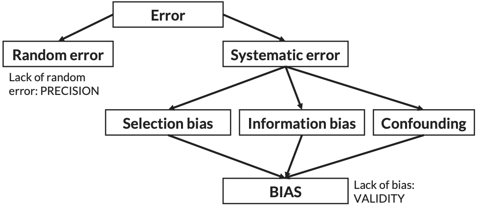
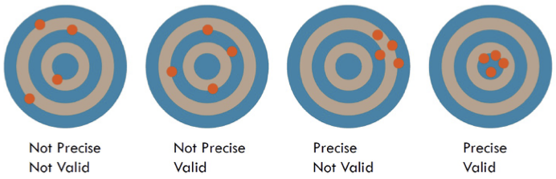
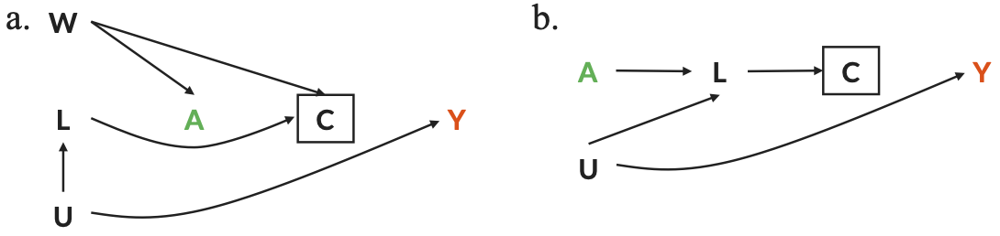

# Selection bias {#selection-bias}

```{r, out.width='100%', fig.align='center', fig.cap = "Types of error", echo = FALSE}

```

There are three broad types of systematic error in epidemiologic studies: selection bias, information bias, and confounding.

Random error differs from systematic error in that its error gets smaller as the sample size (`n`) gets larger. Systematic error does not get better with larger `n`. Selection bias is a type of systematic error.

```{r, out.width='100%', fig.align='center', fig.cap = "Visualization of precision and validity", echo = FALSE}

```

## Selection bias definitions

Selection bias is:

* Distinct from confounding and information bias because of its mechanisms
* Similar to confounding because **exchangeability** is violated
  * $Pr[A=a]$ is not independent of $Y^a$
  
### Definitions
* Traditional: "Selection bias is present when individuals have different probabilities of being included (or retained) in a study sample according to relevant characteristics, namely the exposure and outcome of interest." (Szklo & Nieto, 2019)
* Structural: "Bias resulting from conditioning on a common effect (a collider) of two variables, one of which is the exposure or associated with the exposure and the other is either the outcome or associated with the outcome." (adapted from Hernán, Hernández-Díaz, & Robbins 2004)

### Selection bias in DAGs

#### Brief review of paths
* $A \rightarrow Y$ (A causes Y)
* $A \leftarrow C \rightarrow Y$ (A and Y share a common cause; aka confounding)
* $A \rightarrow \fbox{S} \leftarrow Y$ (A and Y share a common effect; S is a collider)
  * We must condition on the collider S (adjustment or restriction) or a on a descendant of a collider for us to detect a statistical association between A and Y in this scenario

#### Selection bias DAG examples

There are some more complex ways that selection bias can be captured in a DAG.

```{r, out.width='100%', fig.align='center', fig.cap = "Examples of selection bias in DAGs", echo = FALSE}

```

In Fig. 3.3.a., conditioning on the collider, C, opens a backdoor pathway between the exposure, A, and the outcome, Y. This path is $A \leftarrow W \rightarrow \fbox{C} \leftarrow L \leftarrow U \rightarrow Y$.

In Fig. 3.3.b., conditioning on C, the descendant of the collider, L, opens a backdoor path.

Here is a motivational example that displays the intuition behind a collider.

$\text{Rain} \rightarrow \fbox{ Wet sidewalk } \leftarrow \text{Neighbor's sprinkler}$

Take, for example, the question: did it rain last night? Suppose we only observe when the sidewalk is wet. The sidewalk could be wet for two reasons: (1) it rained or (2) your neighbor ran the sprinkler. If we know the sidewalk is wet and that the neighbor's sprinkler is broken, then it probably rained. Knowing information about one of the causes of a collider gives us information about the other.

#### Traditional vs. structural definition

```{r, out.width='100%', fig.align='center', fig.cap = "Examples of selection bias in DAGs", echo = FALSE}

```

The above figure graphically depicts the traditional (Fig 3.4.a) and structural (Fig 3.4.b) definitions of selection bias.

### Examples of selection bias

* There are many ways a study can be subject to selection bias
* Learning about well accepted types of selection bias can help with finding it in our own studies
* Differs somewhat by study design: case-control, cohort, and RCT

#### Selection bias in case-control studies

* "Berkson's bias"
  * Particularly relevant for hospital-based case-control studies
  * Occurs when **controls are not selected independent of exposure**
  * Case-control studies are thought to be particularly susceptible to selection bias because at the very least $Y \rightarrow \fbox{S}$

Take the DAG in Fig. 3.4.b to represent a hospital-based case-control study of the malnutrition (A) on depression (Y). Because of the study design, those with depression (Y) are more likely to be included in the study (C). Malnutrition by itself is likely to cause somebody to be admitted to the hospital (C). This is called "Berkson's Bias."

#### Selection bias in cohort studies
* Selection bias in cohort studies typically arises because of **loss to follow-up** or mortality related to both the outcome and the exposure.

Take the DAG in Fig. 3.3.a to represent a cohort study of occupational exposure (A) on risk of stroke (Y). The terrible work conditions of the job (W) is a common cause of exposure (A) and likelihood that a person will quit (C). Underlying health status (U) is a cause of stroke (Y) and causes a person to quit (C) through deteriorating physical health (L). This is also called the "healthy worker effect."

#### Selection bias in cross-sectional studies
* Cross-sectional studies are also susceptible to selection bias.
* Sometimes this is referred to as "incidence-prevalence bias."
* Prevalent cases with better prognosis or underlying health are more likely to show up in your study.

Take the DAG in Fig. 3.4.b to represent a study of the effect of folic acid (A) at conception on the prevalence of birth defects (Y). Only those babies born were included in the study (C).

##### Selection bias in randomized control trials (RCT)
* RCTs are often thought to be the "gold standard" of causal inference
* While they are less likely to be subject to confounding, they are equally likely to be subject to selection bias due to loss to follow-up.

Take the DAG in Fig. 3.3.b to represent a study of AZT (A) on development on AIDS (Y). Treatment A and illness severity (U) both cause side effects (L) which leads to dropout (C).

## Key points
* Selection bias is a type of systematic error related to recruitment or retention of participants.
* Recruitment or retention must be related to exposure and outcome to cause bias.
* We can visualize selection bias on DAGs.
* All types of studies are subject to selection bias but it might look different depending on the study.
