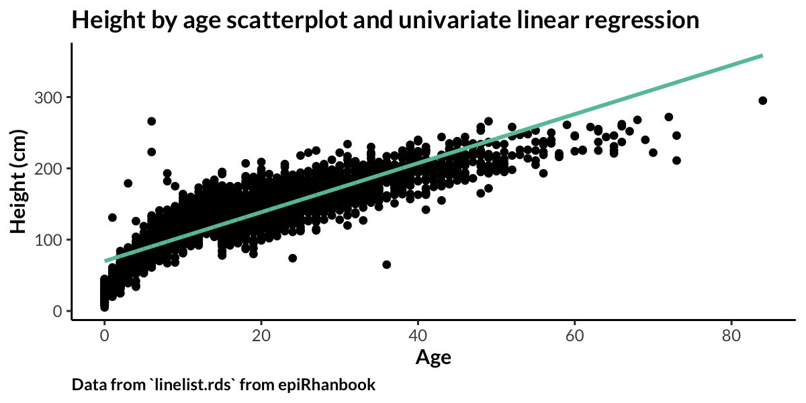

# Regression {#regression}

*Material excerpted and adapted from [Bender 2009](https://www.hopkinsmedicine.org/gynecology_obstetrics/pdfs/medstudent/rtc2014/Epi%20Study%20Design%20and%20Exploratory%20Analyses_abb.pdf) and [epiRhandbook](https://www.epirhandbook.com/en/)*

One of the most important analysis related methods to deal with confounding is multiple regression analysis. 

The most important methods are:

* Linear regression for continuous outcomes
* Logistic regression for binary outcomes
* Cox regression for time-to-event data, and
* Poisson regression for frequencies and rates

Other methods are, for example, stratification, the use of instrumental variables, or the application of propensity scores. In this chapter, an overview of the most important multiple regression models is given with a focus on applications in modern epidemiology.

## Linear regression

The use of simple linear regression is possible if the effect of one continuous explanatory variable X, for example, Body mass index measured in kilograms per square meter on one continuous response variable Y, for example, systolic blood pressure measured in millimeters of Hg is to be investigated. The fundamental model equation is given by

$$
Y = \beta_0 + \beta_1x + \epsilon
$$

where $\beta_0$ is the intercept, $\beta_1$ is the regression coefficient for $X$, $x$ is the observed value for $X$, and $\epsilon$ is the random error describing individual deviations from the mean of $Y$ given $X=x$, also called the residual term.

```{r, out.width='100%', fig.align='center', fig.cap = "An example of a univariate regression analysis", echo = FALSE}

```

The ordinary least squares estimates of the parameters $\beta_1$ and $\beta_0$ are given by

$$
\hat{\beta}_1 = \frac{\sum_{i=1}^{n} (x_i-\bar{x})(y_i-\bar{y})}{\sum_{i=1}^{n} (x_i-\bar{x})^2}
$$

and

$$
\beta_0 = \bar{y}-\hat{\beta}_1\bar{x}
$$

where $\bar{x}$ and $\bar{y}$ are the arithmetic means of $x_i$ and $y_i$, $i=1,...,n$, respectively.

In summary, the goal of regression models are threefold:

1. To determine whether the variables $Y$ and $X$ are systematically related (test of $H_0:\beta_1=0$).
2. To estimate the effect size of $X$ on $Y$ by means of $\hat{\beta}_1$ (complemented by a 95% confidence interval)
3. To predict the expected value of $Y$ for given values of $X$ (with 95% confidence interval)

### Multiple linear regression
Simple linear regression plays a negligible role in epidemiology for two reasons:

1. Binary (logistic) and time-to-event (Cox) outcomes are much more common than continuous response variables
2. The effects of **confounders** have to be taken into account, so that multiple linear regression should be applied even if we are interested mainly in the effect of one primary explanatory variable. The multiple linear regression model is an extension of the univariate linear regression model where instead of only one explanatory variable $X$ several explanatory variables $X_1,...,X_k$ with observed values $x_1,...,x_k$ are considered. The fundamental model equation is given by

$$
Y = \beta_0 + \beta_1 x_1 + ... + \beta_k x_k + \epsilon
$$

As mentioned above, we can test whether th explanatory variable $X_j (j=1, ..., k)$ has a significant effect on the response $Y$, we can describe the estimated effect size of $X_j$ by means of $\hat{\beta}_j$ for $j=1,...,k$ (with CIs), and we can predict the expected value of $Y$ for given values of $X_1, ..., X_k$ (with CIs).

This model can describe the effects of several explanatory variables simultaneously and the regression coefficient $\beta_j$ represents the effect for $X_j$ adjusted for all other explanatory variables. In general, it is misleading to assess the associations of the response $Y$ and several explanatory variables by means of several simple linear regression models.

### Assumptions
There are four assumptions for conducting linear regression:

1. Linear relationship
2. Independence
3. Homoscedasticity
4. Normality
....
